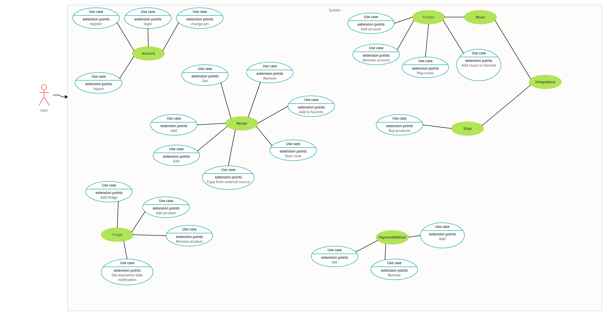

# Курсовая работа на тему "Приложение с рецептами"

Проект простого приложения для поиска рецептов со сторонних ресурсов и быстрого доступа к ним.

## Запуск

Для запуска приложения Вам необходимо иметь установленный Docker. Вводим команду для запуска: 

```shell
docker compose up -d
```

После выполнения команды Docker сам соберет всё необходимое и запустит проект.

## Компоненты проекта

### Backend
Отвечает за всю логику проекта и взаимодействие с БД.

Стек: Python 3.10, FastAPI, SQLAlchemy, Pydantic, Alembic

### Fronted
Отвечает за пользовательский интерфейс.

Стек: TypeScript, Vue JS, Nuxt 3, Tailwind CSS, Shadcn UI,

## Анализ предметной области

Пользователи такого приложения включают в себя как любителей кулинарии, которые ищут новые рецепты и идеи для готовки, 
так и профессиональных поваров, которые могут использовать приложение для вдохновения и обмена опытом.
Сайт обычно содержит рецепты, ингредиенты, пошаговые инструкции по приготовлению, советы по выбору продуктов, а также 
возможность оценить блюдо или оставить комментарий. Кроме того, такой сайт может предлагать функции по поиску рецептов 
по разным критериям, созданию списков покупок и сохранению любимых рецептов. Пользователи могут находить новые идеи для 
приготовления еды, узнавать об интересных кулинарных тенденциях, а также делиться своими собственными рецептами и опытом 
с другими участниками сообщества. 

## Диаграммы




## Скриншоты работы приложения

### Страница выбора пользователя
На странице предоставлен список всех доступных пользователей для входа.


### Страница входа
Данная страница имеет условную логику отображения. Отображается только в случае, если выбранный пользователь установил
пин-код для входа.


### Главная страница
На главной странице представлен основная поисковая строка для поиска рецептов, имя пользователя в рамках текущей
открытой сессии, навигационная панель слева и основная область с рецептами, которые пользователь добавил для себя.


### Страница поиска
Страница поиска похожа на главную страницу, но имеет иную логику отображения основного блока контента.
В данном случае, в качестве содержимого, предоставляются результаты поиска по пользовательскому запросу в 
поисковой строке в шапке сайта.
Отображаются карточки товаров, содержащие базовую информацию о рецептах: название, категорию, кухню, фото (если есть), КБЖУ


